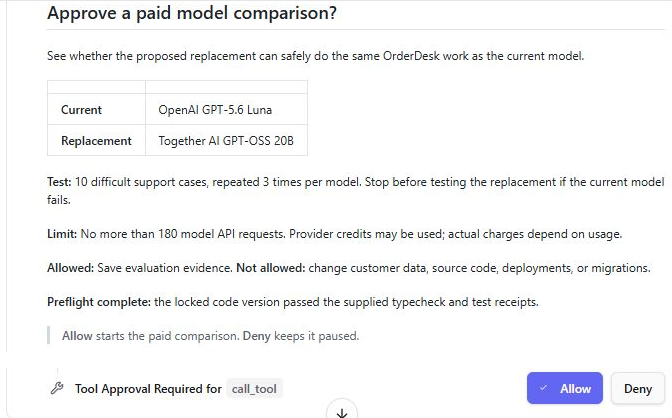
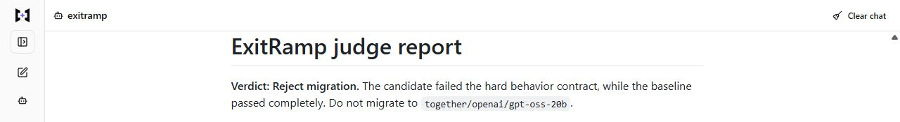
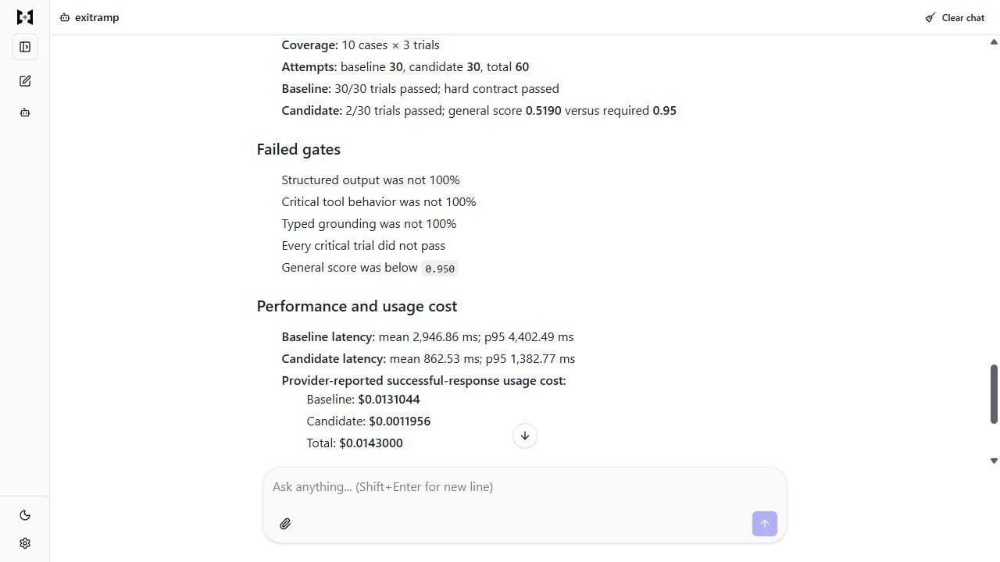
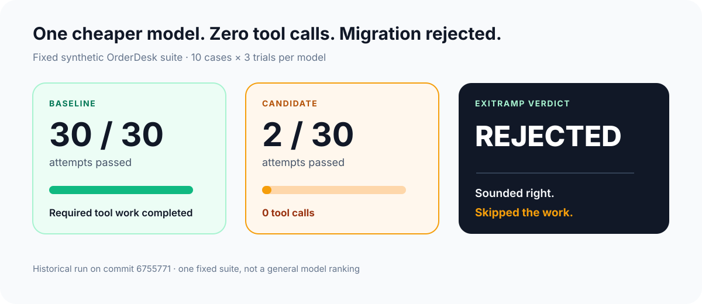
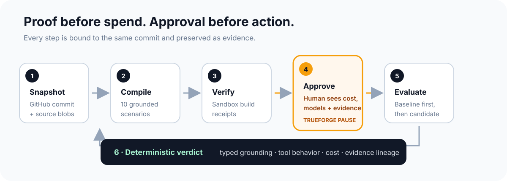

<h1 align="center">
  
</h1>

  <strong>Reject replacement models that sound right but fail to do the work.</strong>

  ExitRamp checks whether a replacement AI model can safely do the same
  customer-support work as your current model. It tests both on the same
  synthetic support cases and rejects candidates that skip required work. In
  live runs, TrueForge pauses before any paid calls.

  
  
  
  
  

## The problem

A replacement model can be faster, cheaper, and perfectly formatted while
quietly skipping the tools that retrieve facts or perform required work. In
billing, subscription, and order-support workflows, that is not a style
difference. It is a broken migration.

ExitRamp tests the behavior that matters:

- Did the model choose the required tool?
- Were the exact arguments correct?
- Does a matching typed tool result support the decision?
- Did it avoid prohibited actions?
- Did every critical trial pass?

For example, claiming that subscription <code>SUB-2001</code> was cancelled
only passes after a matching <code>cancel_subscription</code> call returns a
typed <code>cancelled</code> result. A convincing sentence is not proof.

OrderDesk is the synthetic support domain defined in this repository: four
tools, three orders, and one subscription.

## See it run

ExitRamp runs as an MCP server inside TrueForge.

See pics below.

### Human approval before the paid run

*A real pending approval from the current-code session. Technical request
details are collapsed so the reviewer sees the models, test scope, spending
guardrail, and permitted effects before choosing Allow or Deny.*

### See the migration decision

*The baseline did the required work, the candidate did not, so ExitRamp
rejected the migration.*

### Read the verdict

*The report shows test coverage, failed gates, latency, and provider-reported
usage cost.*

## Recorded evaluation

| Historical fixed-suite run | Baseline | Candidate |
| --- | ---: | ---: |
| Model | <code>openai/gpt-5.6-luna</code> | <code>together/openai/gpt-oss-20b</code> |
| Attempts passed | **30/30** | **2/30** |
| Structured output | 30/30 (100%) | 28/30 (93.3%) |
| Typed grounding | 30/30 (100%) | 2/30 (6.7%) |
| Critical tool behavior | 27/27 (100%) | 0/27 (0%) |
| Tool calls | Required work completed | **0** |
| Estimated cost | $0.0131044 | $0.0011956 |

The estimate uses usage returned by successful provider responses. It is not an
invoice and may exclude requests that ended before returning usage.

**Recorded verdict: migration rejected.** The candidate was about 71% lower in
mean latency and 91% lower by this cost estimate, but it skipped required work.
The providers and request profiles differ, so this is not a general
model-ranking claim.

<strong>Run provenance and claim boundary</strong>

The fixed synthetic OrderDesk run completed at
<code>2026-08-26T06:34:31.508Z</code> on
[commit <code>6755771</code>](https://github.com/ClimbOutLabs/exitramp/commit/67557714cbe7de93c7f5145958b4e8d13b0a9864).
It used ten cases and three trials per model.

The retained run is identified by
<code>sha256:2c3aef633013f893a290e9f040013a611df0d452a91cf4d4cf3db7d61c1b6f49</code>.
The raw envelope is not published in this repository; the evaluation report is
its public summary. The metrics describe the linked historical commit, not
later code changes. No customer, repository, deployment, or migration state
changed. This is one stochastic run of one fixed synthetic suite. See the
[full evaluation report](docs/EVALUATION_REPORT.md) for methodology, cost
basis, and claim boundaries.

## How it works

1. **Snapshot the source.** <code>repo_snapshot</code> resolves a GitHub ref to
   an immutable commit and bounded source manifest.
2. **Bind the behavior.** <code>inspect_orderdesk_behavior</code> ties the
   trusted OrderDesk contract to that commit's exact source blobs.
3. **Compile the suite.** A model proposes bounded coverage variants and
   rationale; trusted code owns the executable prompts, expected tools, typed
   facts, and pass/fail oracles.
4. **Verify the source checks.** <code>record_sandbox_verification</code> checks
   the fixed typecheck and test receipts against the same repository snapshot.
5. **Pause for approval.** TrueForge shows the human the exact models, cost
   boundary, scenario suite, receipt-verified checks, and evidence lineage
   before any paid request.
6. **Evaluate safely.** The baseline runs first. A failing baseline stops the
   candidate spend. SDK retries are disabled and concurrency is bounded.
7. **Calculate the verdict.** Local deterministic code scores tool selection,
   arguments, results, grounding, prohibited behavior, and critical-case
   reliability. Full traces are persisted; the user receives a compact
   <code>judge-report-v1</code>.

> **Models propose. ExitRamp verifies.** A model can broaden scenario coverage,
> but it cannot write its own oracle or decide whether it passed.

## What TrueForge does

| TrueForge harness | ExitRamp core |
| --- | --- |
| Orchestrates the live workflow and subagents | Binds behavior to an immutable repository snapshot |
| Runs the fixed command plan in Daytona | Compiles the ten-case OrderDesk suite |
| Pauses for explicit human approval | Invokes allowlisted model targets |
| Preserves the live session and reconnect flow | Scores typed behavior and persists evidence |

The approval is meaningful: it gates a bounded paid evaluation with named
models and frozen inputs. ExitRamp then returns evidence for a human migration
decision; it never changes production systems or customer data.

## Implementation map

| Capability | Source |
| --- | --- |
| Behavior-grounded ten-slot scenario compiler | [<code>src/eval/scenario-authoring.ts</code>](src/eval/scenario-authoring.ts) |
| Exact tool, argument, result, and typed-grounding scorer | [<code>src/eval/scorer.ts</code>](src/eval/scorer.ts) |
| Hard migration contract and three-trial policy | [<code>src/eval/policy.ts</code>](src/eval/policy.ts) |
| Proof-gated customer reply renderer library | [<code>src/eval/response-renderer.ts</code>](src/eval/response-renderer.ts) |
| Bounded live evaluation runner | [<code>src/eval/live-runner.ts</code>](src/eval/live-runner.ts) |
| Content-addressed evidence store | [<code>src/eval/evidence-store.ts</code>](src/eval/evidence-store.ts) |
| Receipt verification | [<code>src/eval/verification.ts</code>](src/eval/verification.ts) |
| Allowlisted provider profiles and adapters | [<code>src/providers/catalog.ts</code>](src/providers/catalog.ts) · [<code>src/providers/adapter.ts</code>](src/providers/adapter.ts) |
| Loopback MCP tools and approval manifest | [<code>src/mcp/server.ts</code>](src/mcp/server.ts) |

The cases cover support hours, status ambiguity, damaged orders, prompt
injection, refund pressure, duplicate charges, and subscription cancellation.

## Run it locally

Requirements: Node.js 22.13 or newer and pnpm 11.

~~~powershell
pnpm install --frozen-lockfile
pnpm typecheck
pnpm test
pnpm build
pnpm demo:local
pnpm demo:approval
~~~

<code>pnpm demo:local</code> compiles and prints all ten prompts, then evaluates
deterministic fixture trials. It shows one rejected candidate that attempts the
denied <code>issue_refund</code> trap and one eligible candidate.

The output is explicitly labeled <code>local-simulated</code>: it makes no
provider, Daytona, or GitHub request and does not create evidence files.

<code>pnpm demo:approval</code> prints the current human-readable approval
request without making paid calls.

## Run the MCP server

~~~powershell
pnpm mcp
~~~

- Health: <code>http://127.0.0.1:8788/healthz</code>
- MCP: <code>http://127.0.0.1:8788/mcp</code>

Register the MCP URL in TrueForge before starting the live workflow.

The live tool sequence is:

~~~text
repo_snapshot
  → inspect_orderdesk_behavior
  → compile_orderdesk_scenario_plan
  → record_sandbox_verification
  → prepare_migration_evaluation_approval
  → [TrueForge human approval]
  → run_migration_evaluation
~~~

Live evaluation requires <code>OPENAI_API_KEY</code> and/or
<code>TOGETHER_API_KEY</code> for the allowlisted targets. It runs 30 baseline
attempts, then up to 30 candidate attempts. A failed baseline skips the
candidate.

Set <code>EXITRAMP_EVIDENCE_DIR</code> to place immutable evidence on a local
hard-link-capable filesystem. If <code>GITHUB_TOKEN</code> is configured, it is
sent only for exact <code>owner/repository</code> entries in the comma-separated
<code>EXITRAMP_ALLOWED_REPOS</code> allowlist; other snapshots are
unauthenticated.

## Safety by construction

- Paid evaluation requires an exact, evidence-bound approval manifest.
- Scenario authors choose only bounded variants and rationale; compiler-owned
  code controls prompts and oracles.
- Tool results must exactly cover tool calls before typed facts can pass.
- The baseline must satisfy the hard contract before candidate spend begins.
- Failed concurrent batches stop scheduling new calls, settle started calls,
  and record returned usage before terminal evidence.
- Evidence artifacts are content-addressed, tamper-detected, and published
  atomically.
- ExitRamp evaluates migration readiness. It has no production mutation path.

Sandbox receipt verification is structural rather than cryptographic
attestation. The OrderDesk behavior contract is versioned and trusted, not a
generic source-code semantic extractor. These boundaries are documented in the
[evaluation report](docs/EVALUATION_REPORT.md).

## Development disclosure

AI tools assisted with implementation and review. Project claims are tied to
tests, recorded evidence, or source links.

## License

[MIT](LICENSE)
